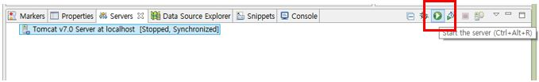

# 02. 개발 환경 설정

## 2-1. JDK 설치

* JSP 및 Servlet은 Java를 기본언어로 사용한다.
* 그러므로 JDK(Java Development Ket)를 설치한다.

1. [https://oracle.com/kr/index.html](https://oracle.com/kr/index.html)에 접속
2. JDK 설치(JDK 8u221)

## 2-2 Path 설정

* 환경변수 PATH에 javac.exe를 포함시켜 어느 디렉토리에서나 javac.exe가 실행될 수 있도록 설정한다.

1. 시스템 속성 > 고급 > 환경 변수
2. 시스템 변수 생성 및 수정

3. command 창에서 javac 명령어 인식 확인

## 2-3. 이클립스 다운로드

* IDE(개발툴) 이클립스 설치

1. [https://www.eclipse.org/downloads](https://www.eclipse.org/downloads/) 접속
2. JAVA EE 버전 다운로드 및 설치

## 2-4. 톰캣 설치

* 웹 컨데이터 톰캣 설치

1. [https://tomcat.apache.org/download-70.cgi](https://tomcat.apache.org/download-70.cgi) 접속
2. zip 파일 다운로드
3. zip 파일 압축 해제

4. 이클립스 연동

5. 이클립스 툴 아래 Servers 탭에서 server 생성

## 2-5. 톰캣 환경 설정

1. 서버 더블 클릭

2. 서버 실행

3. 서버 구동 확인

4. 서버 중지

