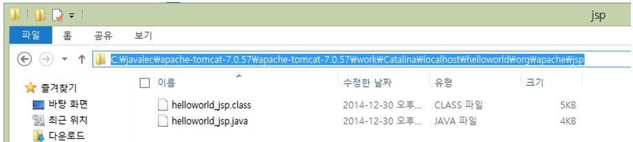

# 03. JSP 맛보기

## 3-1. JSP 문서 작성하기

* JSP 특징
  * 동적 웹 어플리케이션 컴포넌트
  * .jsp 확장자
  * 클라이언트의 요청에 의해 동적으로 작동하고, 응답은 html을 이용
  * jsp는 서블릿으로 변환되어 실행
  * MVC 패턴에서 View로 이용됨

1. 프로젝트 생성

2. jsp 파일 생성

3. jsp 파일 실행(`ctrl` + `f11`)

## 3-2. JSP 아키텍처

1. 아키텍처

2. 생성 파일 위치

