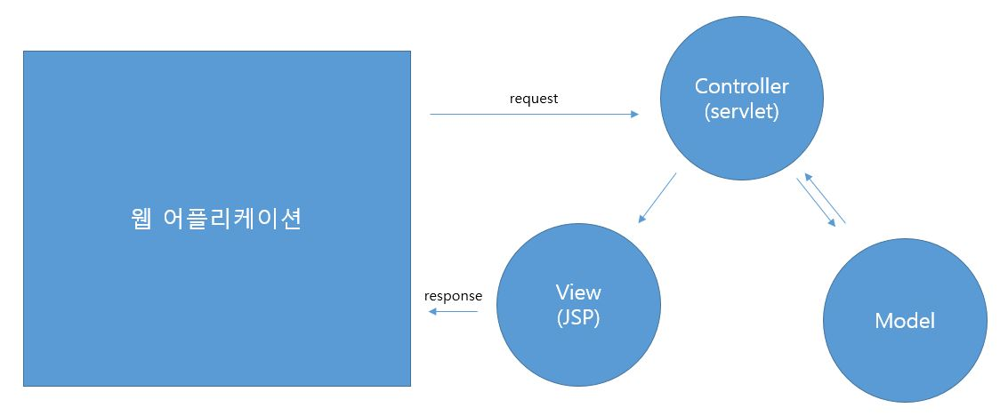
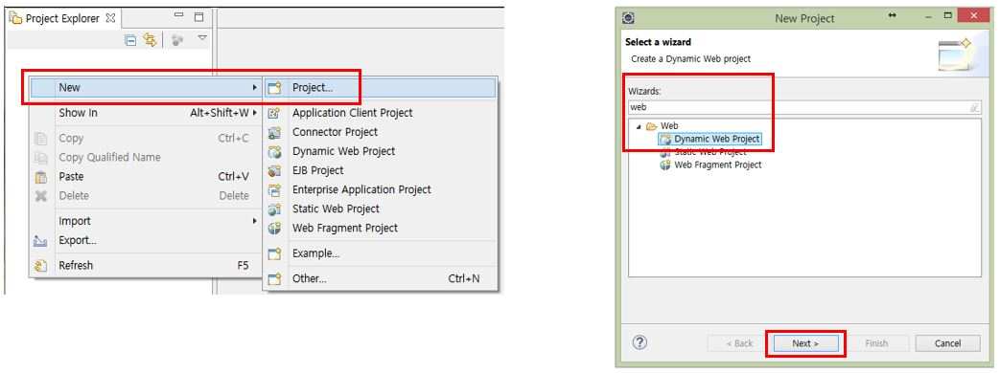
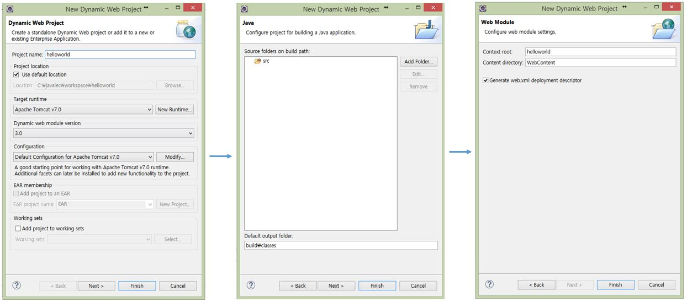
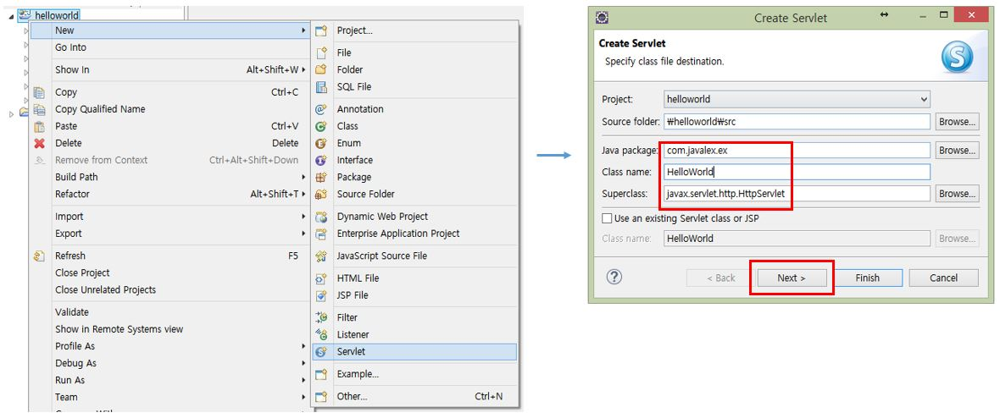
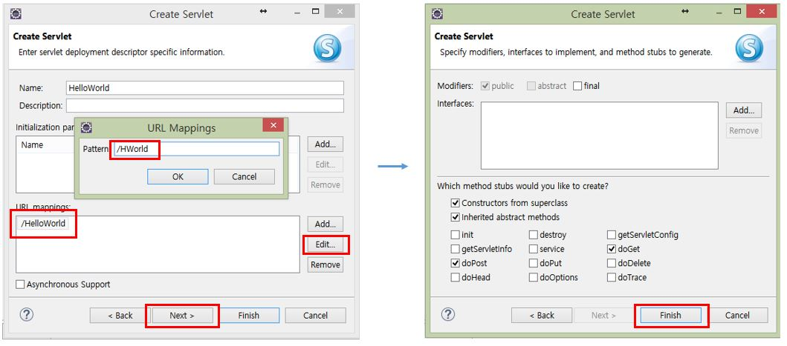
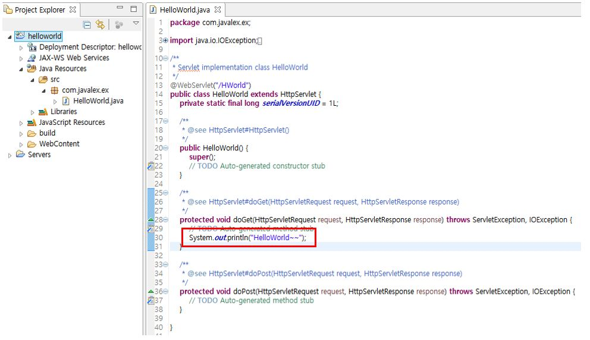
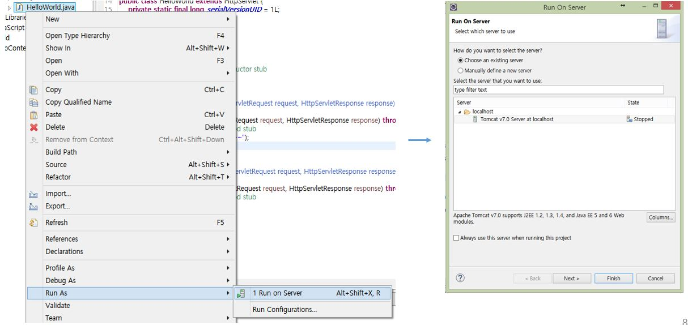
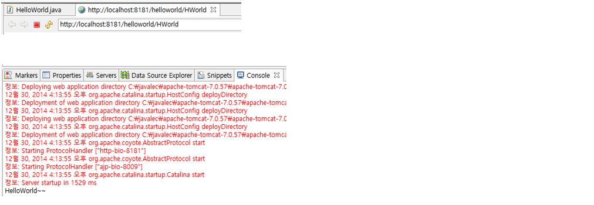

# 04. Servlet 맛보기

## 4-1. Servlet 문서 작성하기

* Servlet 특징
  * 동적 웹 어플리케이션 컴포넌트
  * .java 확장자
  * 클라이언트의 요청에 동적으로 동작하고, 응답은 html을 이용
  * java thread를 이용하여 동작
  * MVC 패턴에서 Controller로 이용됨

1. 프로젝트 생성

2. servlet 파일 생성

3. servlet 파일 작성

4. servlet 실행

