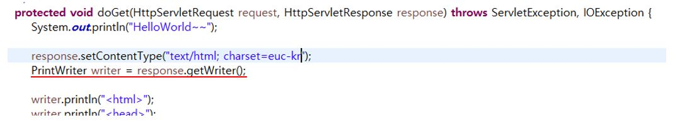
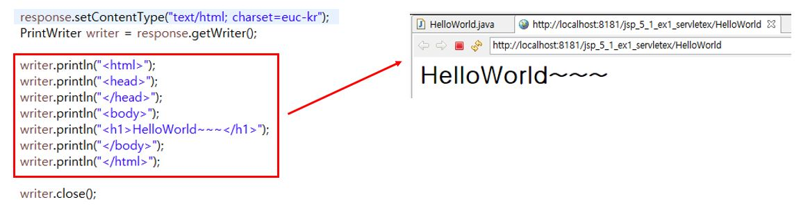

# 05. Servlet-1

## 5-1. 프로젝트 만들기

* Servlet은 java를 이용하여 웹 프로그램을 만드는 것
* Servlet 클래스는 HttpServlet 클래스를 상속받는다.

* 요청 처리 객체 및 응답 처리 객체를 톰캣에서 받는다.

* GET, POST 방식에 따라 동작하는 함수가 다르다.

## 5-2. doGet()

* 응답 요청이 get 방식일 경우 호출된다.
* url 입력을 통한 요청은 get 방식이다.
* doGet() 메소드는 매개변수로 HttpServletRequest와 HttpServletResponse를 받는다.

* HttpServletResponse 객체의 setContentType() 메소드를 호출하여 응답 방식을 결정한다.

* HttpServletResponse 객체의 getWriter() 메소드를 이용하여 출력 스트림을 얻는다.

* 출력 스트림의 println() 메소드를 이용하면 웹 브라우저에 출력된다.
* 마지막에 출력 객체를 닫는다.

## 5-3. doPost()

* 응답 요청이 post 방식일 경우 호출된다.

## 5-4. 컨텍스트 패스(Context Path)

* WAS(Web Application Server)에서 웹 어플리케이션을 구분하기 위한 Path
* 이클립스에서 프로젝트를 생성하면, 자동으로 server.xml에 추가

