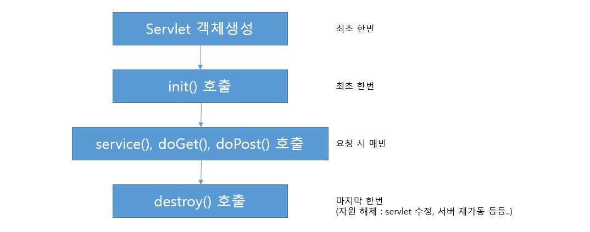
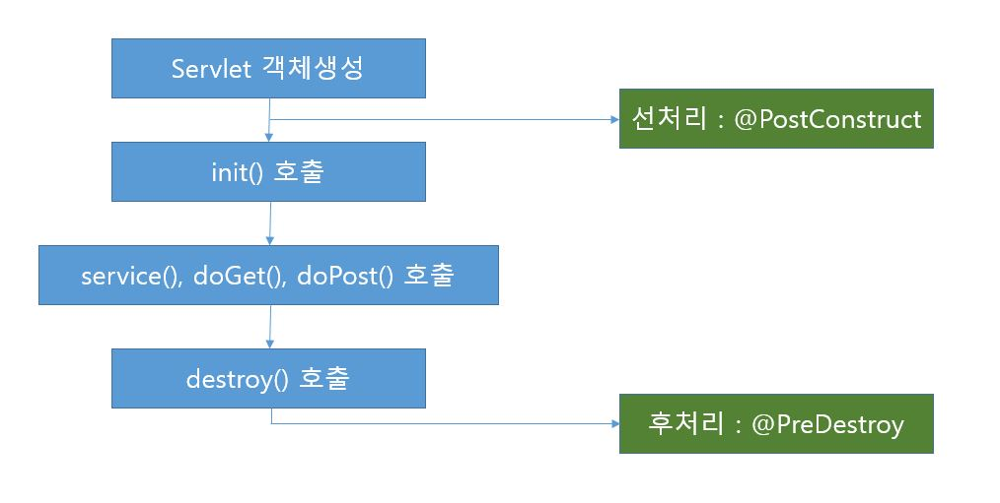

# 06. Servlet-2

## 6-1. Servlet 작동 순서

* 클라이언트에서 Servlet 요청이 들어오면 서버에서는 Servlet 컨테이너를 만들고, 요청이 있을 때마다 스레드가 생성된다.

## 6-2. Servlet 라이프사이클(생명 주기)

* Servlet의 장점은 빠른 응답 속도
* Servlet은 최초 요청 시 객체가 만들어져 메모리에 적재된다.
* 이후 요청 시에는 기존의 객체를 재활용한다.

## 6-3. Servlet 선처리, 후처리

* Servlet 라이프사이클 중 init() 메소드 호출 전에 선처리가 가능하다.
* destroy() 메소드 호출 후에 후처리가 가능하다.

