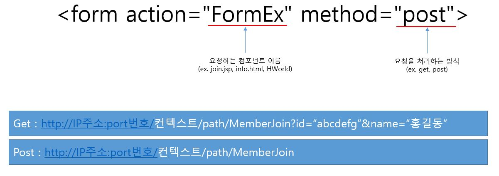
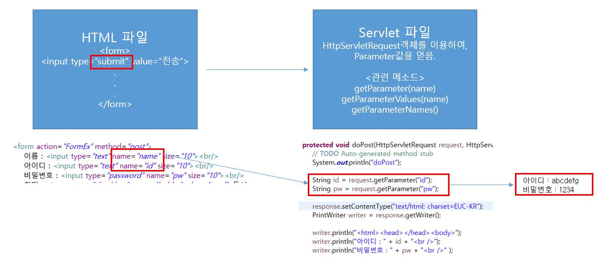
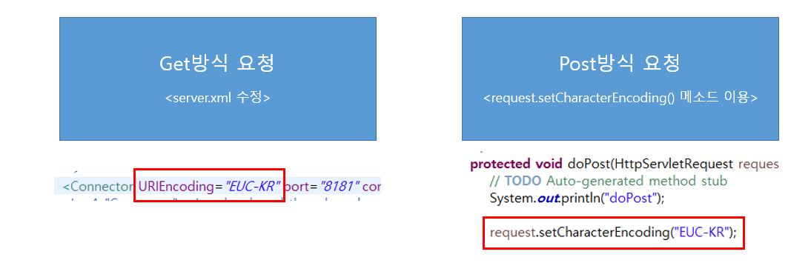

# 07. Servlet-3

## 7-1. Html form 태그

* form 태그는 서버로 정보를 전달할 때 사용하는 태그

1. input

- 속성(type, name, value)
  - type : 태그 종류 지정(text, password, submit, checkbox, radio, reset, ...)
  - name : input 태그 이름
  - value : name에 해당하는 값

```html
<!-- text -->
<input type="text" name="name" size="10">
<!-- password -->
<input type="password" name="name" size="10">
<!-- submit -->
<input type="submit" value="전송">
<!-- reset -->
<input type="reset" value="초기화">
<!-- checkbox -->
<input type="checkbox" name="hobby" value="read">독서
<input type="checkbox" name="hobby" value="cook">요리
<input type="checkbox" name="hobby" value="run">조깅
<input type="checkbox" name="hobby" value="swim">수영
<input type="checkbox" name="hobby" value="sleep">취침
<!-- radio -->
<input type="radio" name="major" value="kor">국어
<input type="radio" name="major" value="eng" checked="checked">영어
<input type="radio" name="major" value="mat">수학
<input type="radio" name="major" value="des">디자인
<!-- select -->
<select name="protocol">
    <option value="http">http</option>
    <option value="ftp" selected="selected">ftp</option>
    <option value="smtp">smtp</option>
    <option value="pop">pop</option>
</select>
```

2. form 태그

- input 태그들의 값을 서버로 전송하기 위한 정보를 담고 있다.



- form 태그의 submit 버튼을 클릭하여 데이터를 서버로 전송하면, 해당 파일(servlet)에서는 HttpServletRequest 객체를 이용하여 Parameter 값을 얻을 수 있다.



- tomcat 서버의 기본 문자 처리 방식은 IOS-8859-1 방식이다. 따라서 별도의 한글 인코딩을 하지 않으면 한글이 깨져 보인다.



