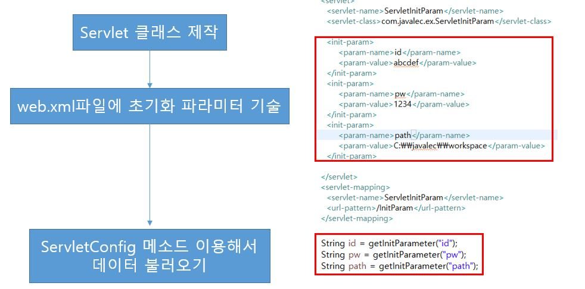
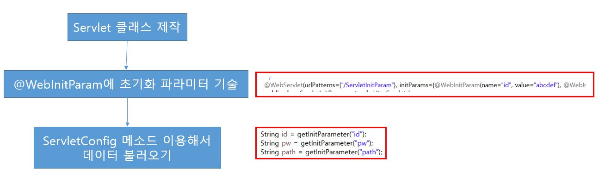
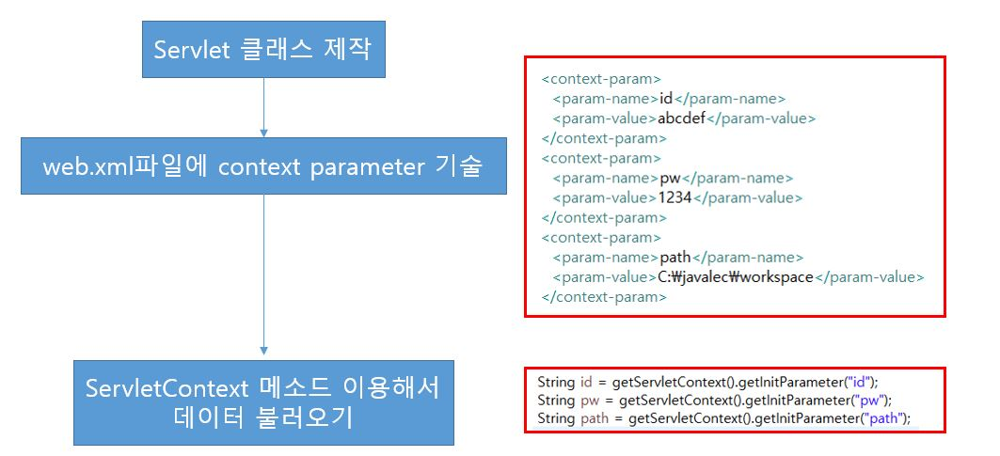
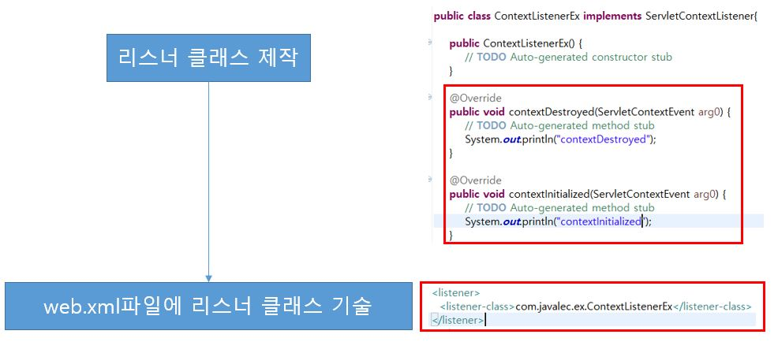
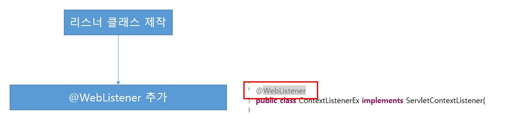

# 08. Servlet-4

## 8-1. ServletConfig

* 특정 Servlet이 생성될 때 초기에 필요한 데이터들이 있을 수 있다.(특정 경로, 아이디 등)
* 이러한 데이터들을 초기화 파라미터라 하며, web.xml에 기술하고 Servlet 파일에서는 ServletConfig 클래스로 접근한다.
* 초기화 파라미터는 web.xml에 기술하는 방법과 Servlet 파일에 직접 기술하는 방법이 있다.

* web.xml에 초기화 파라미터(initialization parameter) 기술

* Servlet 파일에 초기화 파라미터(initialization parameter) 기술

## 8-2. ServletContext

* 여러 Servlet에서 특정 데이터를 공유해야 할 경우 context parameter를 web.xml에 기술하고, Servlet에서 공유하여 사용한다.

## 8-3. ServletContextListener

* ServletContextListener는 웹 어플리케이션의 생명주기(Life Cycle)을 감시하는 리스너이다.
* 해당 리스너의 contextInitialized()와 contextDestroyed() 메소드는 웹 어플리케이션의 시작과 종료 시 호출된다.

* web.xml에 리스터 클래스 기술

* 리스터 클래스에 기술(@WebListener)

