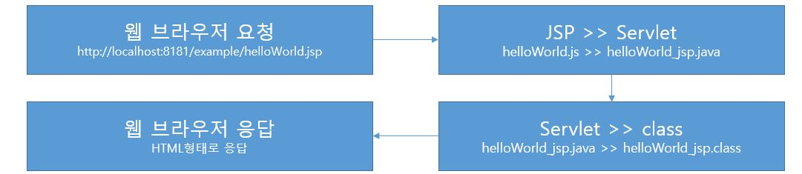

# 09. JSP-1

## 9-1. JSP 태그

* Servlet은 java를 이용하여 문서를 작성하고, 출력 객체를 이용하여 Html 코드를 삽입한다.
* JSP는 Html 문서에 java 언어를 삽입하여 동적 문서를 만든다.
* Html 문서에 java 언어를 삽입하기 위해 태그를 이용한다.

| 태그 종류  | 사용법                      | 역할              |
| ---------- | --------------------------- | ----------------- |
| 지시자     | <%@      %>                 | 페이지 속성       |
| 주석       | <%--     --%>               |                   |
| 선언       | <%!        %>               | 변수, 메소드 선언 |
| 표현식     | <%=       %>                | 결과값 출력       |
| 스크립트릿 | <%          %>              | java 코드         |
| 액션 태그  | <jsp:action>  </jsp:action> | 자바 빈 연결      |

## 9-2. JSP 동작 원리

* 클라이언트가 웹 브라우저로 helloWorld.jsp를 요청
* JSP 컨테이너가 JSP 파일을 Servlet 파일(.java)로 변환
* Servlet 파일(.java)은 컴파일된 후 클래스 파일(.class)로 변환
* 요청한 클라이언트에게 Html 문서 형태로 응답

## 9-3. JSP 내부 객체

* 개발자가 객체를 생성하지 않고 바로 사용할 수 있는 객체
* JSP에서 제공되는 내부 객체는 JSP 컨테이너에 의해 Servlet으로 변환될 때 자동으로 객체가 생성된다.

* 내부 객체 종류
  * 입출력 객체: request, response, out
  * 서블릿 객체: page, config
  * 세션 객체: session
  * 예외 객체: exception