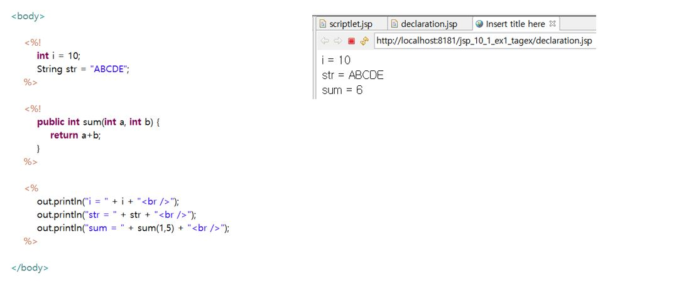

# 10. JSP-2

## 10-1. 스크립트릿, 선언, 표현식

* JSP 문서 안에 java 언어를 넣기 위한 방식

1. 스크립트릿(scriptlet): `<% java 코드 기술 %>`

2. 선언(declaration): `<%! java 코드 기술 %>`

* JSP 문서 안에 사용되는 변수 또는 메소드를 선언

3. 표현식(expression): `<%= java 코드 기술 %>`

* JSP 문서 안에 사용되는 변수의 값 또는 메소드의 호출 결과를 출력
* 출력값은 Stirng이며 `;` 사용 불가

## 10-2. 지시자

* JSP 페이지의 전체적인 속성을 지정할 때 사용

* page, include, taglib 가 있으며, `<%@ 속성 %>` 형태로 사용

  * `page`: 해당 페이지의 전체적인 속성 지정(주로 사용되는 언어 지정 및 import문 사용)

  

  * `include`: 별도의 페이지를 현재 페이지에 삽입(file 속성 이용)

  

  * `taglib`: 태그 라이브러리의 태그 사용
    * 사용자가 만든 tag들을 태그 라이브러리라  한다.
    * 이러한 태그 라이브러리를 사용하기 위해 taglib 지시자를 사용한다.
    * uri 및 prefix 속성이 있다.
    * uri는 태그 라이브러리의 위치 값을 가지며, prefix는 태그를 가리키는 이름 값을 가진다.

## 10.3 주석

* Html 주석 `<!-- comments -->`
* JSP 주석 `<%-- comments -->`

