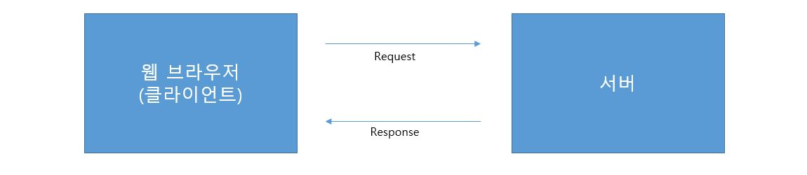
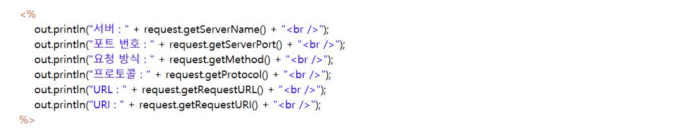
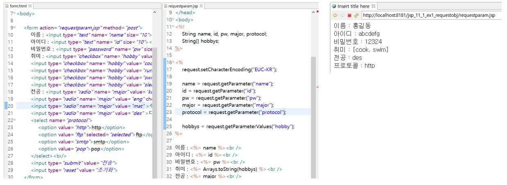
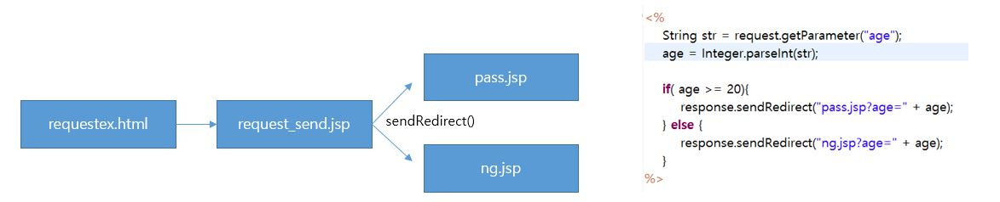

# 11. JSP-3

## 11-1. request 객체

* 웹 브라우저를 통해 서버에 어떤 정보를 요청하는 것을 request라 한다.
* 이러한 요청 정보는 request 객체가 관리한다.

* request 객체 관련 메소드
  * getContextPath(): 웹 어플리케이션의 컨택스트 패스를 얻는다.
  * getMethod(): 요청 방식이 get인지 post인지 구분한다.
  * getSession(): 세션 객체를 얻는다.
  * getProtocol(): 해당 프로토콜을 얻는다.
  * getRequestURL(): 요청 URL을 얻는다.
  * getReqeustURI(): 요청 URI를 얻는다.
  * getQueryString(): 쿼리 스트링을 얻는다.

* Parameter 메소드
  * 위의 request 객체 관련 메소드보다 실제 많이 쓰이는 메소드는 parameter와 관련된 메소드이다.
  * getParameter(String name): name에 해당하는 파라미터 값을 구한다.
  * getParameterNames(): 모든 파라미터 이름을 구한다.
  * getParamegerValues(String name): name에 해당하는 파라미터 값들을 구한다.

## 11-2. response 객체

* 웹 브라우저의 요청에 응답하는 것을 response라 한다.
* 이러한 응답 정보를 가지고 있는 객체를 response 객체라 한다.

* response 객체 관련 메소드
  * getCharacterEncoding(): 응답할 때 문자의 인코딩 형태를 구한다.
  * addCookie(Cookie): 쿠키를 지정한다.
  * sendRedirect(URL): 지정한 URL로 리다이렉트한다.

