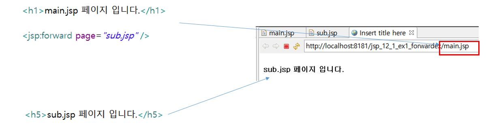
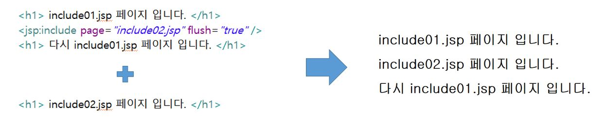
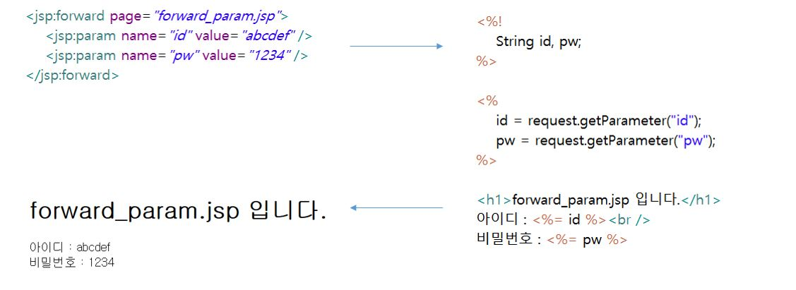

# 12. 액션태그

## 12-1. 액션태그란

* JSP 페이지 내에서 어떤 동작을 하도록 지시하는 태그(페이지 이동, include 등)
* Bean과 관련된 태그도 있다.

## 12-2. forward, include, param 태그

1. forward

* 현재의 페이지에서 다른 특정 페이지로 전환할 때 사용

2. include

* 현재 페이지에 다른 페이지를 삽입할 때 사용

3. param

* forward 및 include 태그에 데이터 전달을 목적으로 사용
* 이름과 값으로 구성

