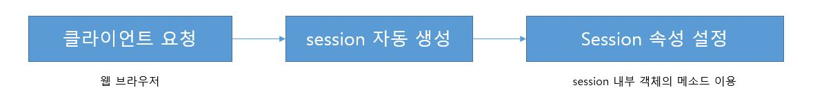

# 14. 세션

## 14-1. 세션이란

쿠키와 마찬가지로 서버와의 관계를 유지하기 위한 수단이다.

단, 쿠키와 달리 클라이언트의 특정 위치에 저장되는 것이 아니라 서버상에 객체로 존재한다.

따라서 세션은 서버에서만 접근이 가능하며 보안이 좋고 저장할 수 있는 데이터의 한계가 없다.

## 14-2. 세션 문법

* 세션은 클라이언트의 요청이 발생하면 자동으로 생성된다.
* session이라는 내부 객체를 지원하여 세션의 속성을 결정할 수 있다.

* `setAttribute()`: 세션에 데이터를 저장
* `getAttribute()`: 세션에서 데이터를 얻음
* `getAttributeNames()`: 세션에 저장된 모든 데이터의 이름(유니크한 키 값)을 얻음
* `getId()`: 자동 생성된 세션의 유니크한 아이디를 얻음
* `isNew()`: 세션이 최초 생성되었는지 이전에 생성된 세선인지 구분
* `getMaxInactiveInterval()`: 세션의 유효기간을 얻음. 가장 최근 요청 시점을 기준으로 카운트
* `removeAttribute()`: 세션에서 특정 데이터 제거
* `Invalidate()`: 세션의 모든 데이터 제거