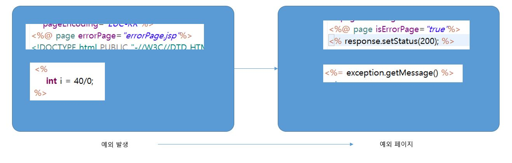

# 15. 예외 페이지

## 15-1. 예외 페이지의 필요성

예외적인 상황이 발생할 경우 웹 컨테이너(톰캣)에서 제공되는 예외 페이지가 보여진다면 현재 서버의 기술적인 문제 등이 노출될 수 있다. 그리고 사용자 입장에서 불쾌할 수 있다.

## 15-2. page 지시자를 이용한 예외 처리

## 15-3. web.xml 파일을 이용한 예외 처리

