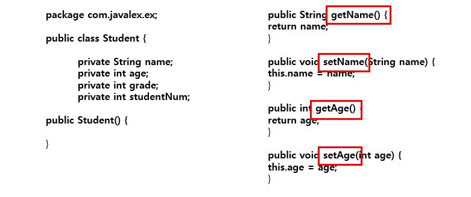
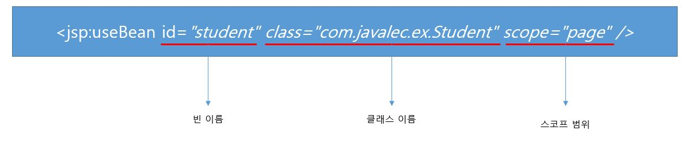
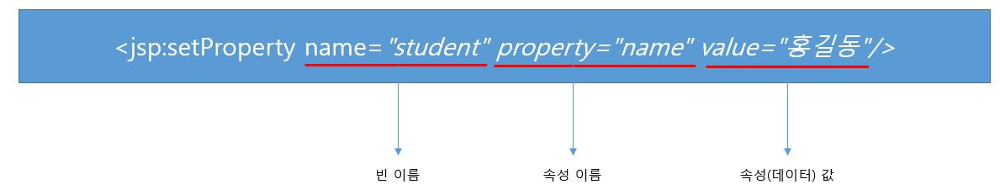
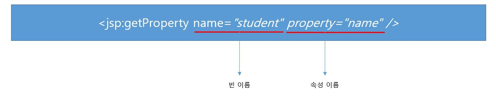

# 16. 자바 빈

## 16-1. 빈

java 언어의 데이터(속성)와 기능(메소드)로 이루어진 특수한 클래스

**자바 빈 설계 규약**

* 멤버변수마다 별도의 getter와 setter를 가진다.
* get 메소드는 매개변수가 존재하지 않는다.
* set 메소드는 반드시 하나 이상의 매개변수가 존재한다.
* 생성자는 매개변수가 존재하지 않는다.
* 멤버변수의 접근제어자는 private이고, set/get 메소드의 접근제어자는 public, 클래스의 접근 제어자는 public으로 정의한다.

## 16-2. 빈 만들기

## 16-3. 빈 관련 액션 태그(useBean, setProperty, getProperty)

1. useBean

* 특정 Bean을 사용한다고 명시

**scope**

* page: 생성된 페이지 내에서만 사용 가능
* request: 요청된 페이지 내에서만 사용 가능
* session: 웹 브라우저의 생명주기와 동일하게 사용 가능
* application: 웹 어플리케이션 생명주기와 동일하게 사용 가능

2. setProperty

* 데이터 값을 설정

3. getProperty

* 데이터 값을 가져옴

